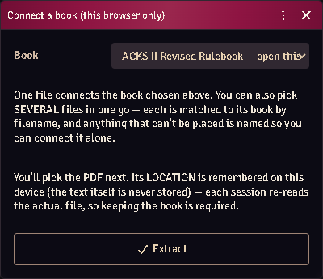

# Connecting a book

The importer reads **your own PDFs**, on your own machine. Nothing is uploaded,
and no book text is stored in the world — a passage resolves per seat, at render
time, from that seat's own copy.

*The book loader, with three books already open on this seat.*

## Connect

Open **ACKS Content** (settings, or the module's macro) → **Connect a book** →
pick the PDF.

The module identifies the edition by **page count plus metadata title**, never by
file hash: DriveThruRPG watermarks each customer's copy, so the bytes differ from
person to person and a hash would only ever match one buyer's file.

Once connected, the count beside the book tells you how many shipped cookbook
entries that connection unlocks.

## Every seat connects its own

A connection belongs to the browser that made it. A player who has the book
connects it themselves and sees the prose; a player who does not sees the
mechanics with the passage left unresolved.

That is the point of the design, not a limitation: the module ships structure and
pointers, never the publisher's words.

## Reconnecting after a reload

Browsers do not keep file permission across a reload without a fresh user
gesture. The module remembers *which* books you had and offers to reopen them;
click through and the permission is re-granted.

Each failure is reported as itself — "it did not reconnect" and "there was
nothing to reconnect" are different problems.

## Common problems

**"That is not the edition I expected."** The page count or metadata title does
not match any known printing. A different printing is not necessarily wrong —
check which book you selected first.

**The count says 0.** The book connected but ships no cookbook entries yet, or
you connected a book the current cookbook does not cover.

**It forgot my book after a reload.** Expected — reconnect from the panel. The
browser will not re-grant file access without a click.
