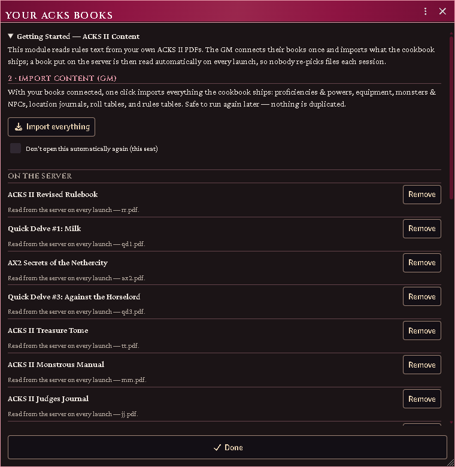

# Importing from the cookbook

The **cookbook** is the shipped database: structure, pointers and extraction
assists, with no prose and no values read from a page. Importing turns an entry
into a real Foundry document, filling in from *your* book what only your book can
supply.

*Connect your books, then import everything the cookbook ships.*

## Import an entry

**ACKS Content → Cookbook**, find the entry, **Import**.

What you get depends on the entry's kind — a monster becomes an Actor with its
weapons and abilities as embedded Items; a proficiency becomes an `ability` Item;
a piece of gear becomes a weapon, armour or item.

The descriptor text is read from your PDF as the document is created and saved
into it, with the book and page as its closing line. Everyone at the table can
read it from then on, and you can edit it like any other description.

## What is filled in, and what is not

**Name and citation, always.** Everything else depends on what a chef-authored
locator was able to read from your book.

Absent a locator, an item is created with the system's defaults and the printed
table governs — and the entry says so with an **unaudited** marker. What the type
buys even with nothing extracted is *behaviour*: a weapon can be equipped,
attacks and takes a fighting style; armour can be worn and counts toward AC.
A plain `item` could do none of that.

## Gear typing

With **acks-extras** installed, gear names route through its equipment root, so a
torch imports as a carried light stack and a flask of holy water as a thrown
splash weapon rather than both being generic items. Without it, the register's
own type stands.

## Starting equipment on a class template

A template's printed Starting Equipment line becomes one item per piece the book
lists. The splitter separates the pieces; it does not judge what they are, so
anything the line names arrives as an item — including a **spell recorded in the
spellbook it came packed with** ("discern magic"), and a **choice the player has
not made yet** ("one spell of character's choice"). Both are the line as printed,
not a misread of it.

Delete the rows that are not gear after generating a character; the pieces that
are gear are already separated correctly. Teaching the importer to tell a spell
from a trinket needs the spell list, which it does not have — see `ROADMAP.md`.

## Where a monster files itself

An imported monster lands in a folder named for the **type its own stat block
declares**, not for the chapter you found it in. A creature whose block types as
a beastman files under *Beastmen* beside the others, however unrelated its entry.

A name that looks misspelled is usually the book's own coinage — the Monstrous
Manual names many creatures unlike their familiar equivalents, and *Hobgholl*
(MM p.188) is a different creature from *Beastman, Hobgoblin* (MM p.53), not a
misreading of it. An entry only imports at all when the heading on your page
matches the one the cookbook expects, so a name that arrived is the name your
book prints. Compare the stat block before assuming a typo.

## Cross-book merging

The same conceptual family imported from a second book gains that book's new
variants rather than becoming a twin. Two signals identify it: a shared member id
and a shared family suffix.

## Rules tables

**Import tables** materializes the rules tables as Foundry documents in your
world. In acks-extras, those register into the shared tables registry and the
henchmen and location features read them.

## Common problems

**"Missing book."** The entry cites a book this seat has not connected. Connect
it, or import anyway and accept the unresolved passage.

**Everything reports as a missing book.** No books are connected on this seat.

**An imported ability shows a ladder, not a number.** Correct — ladders travel
whole and resolve against the character who owns the item.

**I imported twice and got a duplicate.** Import checks for an entry already
present; a duplicate usually means the first copy was renamed or moved out of the
folder it was created in.
